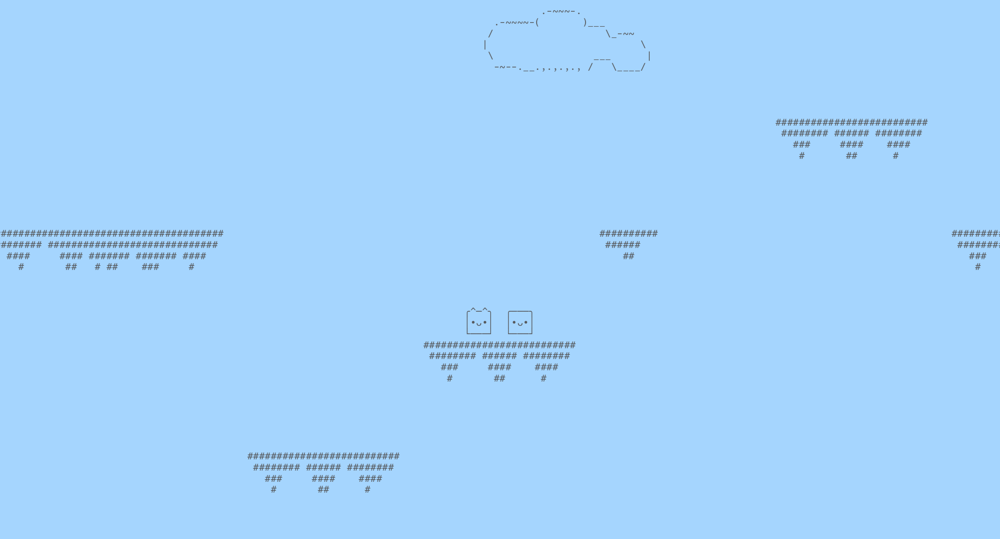

## Install

Install requirements from `requirements.txt` using

```
pip install -r requirements.txt
```

## Quick start

Run using

```
python -m game.main
```

By default, we try to fill all the available terminal space.
If this doesn't work, specify window size manually:

```
python -m game.main --width 120 --height 40
```

## Controls

* WASD and IKJL to move the characters
* ARROWS to move the camera
* R to reset
* ESC to exit